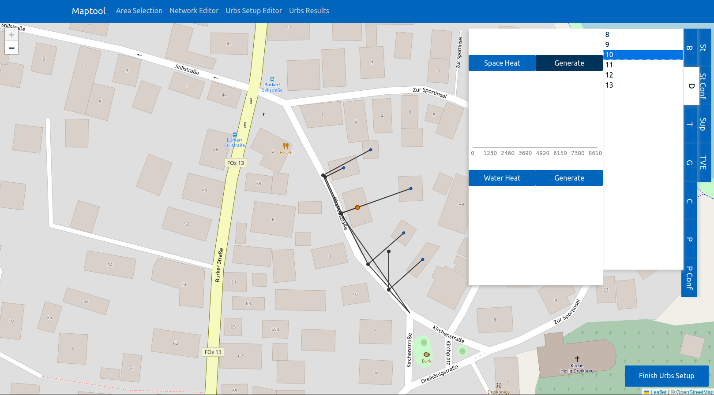
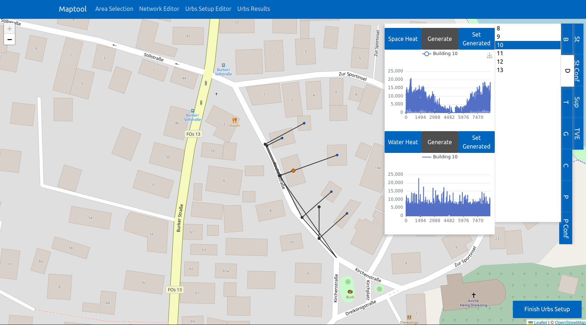
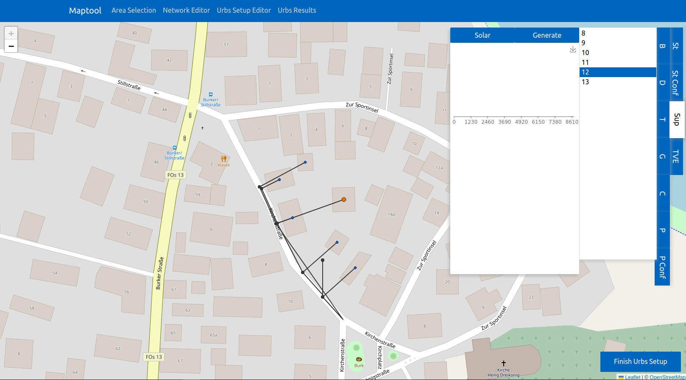
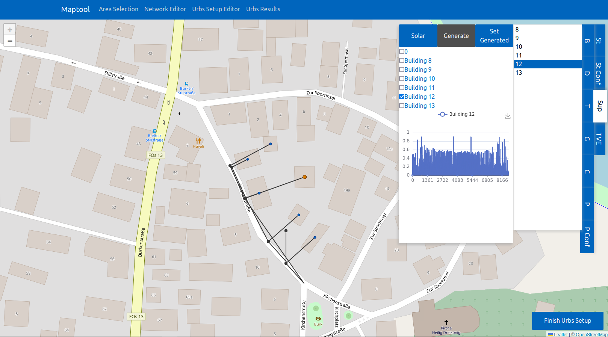
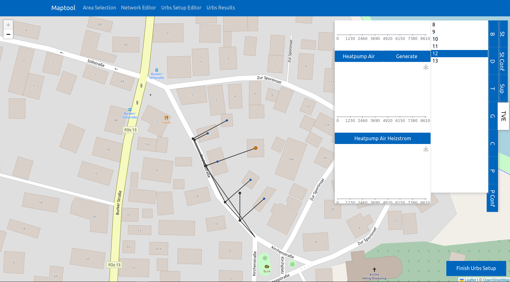
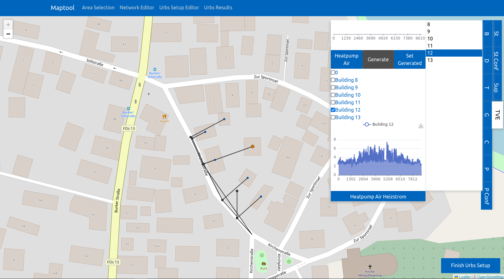

Generating and configuring timeseries for ``urbs`` via the GUI
==============================================================

This section describes the steps for generating timeseries per building in the selected network and configuring them for ``urbs`` via the GUI.

Currently, the GUI supports this functionality for the following timeseries:

* space heat demand
* hot water heat demand
* solar potential
* Coefficient of Performance (COP) for heat pumps
* ambient temperature (used to calculate the heat demand)

To find out how to integrate more timeseries, please refer to the :doc:`development_future_work` section.

Space heat demand & hot water heat demand timeseries
----------------------------------------------------

In the Urbs editor, go to the *Demand* tab.

Select one of the buildings in the network and go to the *Space Heat* or *Water Heat* demand editor.
There you can either choose one of the pre-defined timeseries profiles or create them specifically for the buildings
in the network.

Generating the timeseries
^^^^^^^^^^^^^^^^^^^^^^^^^

The new UI for the *Demand* tab in the Urbs editor. The new "Generate" button is right to the respective name of the demand in the GUI.

To generate the timeseries for the heat demand and hot water demand for each building,
click the Button "Generate" in either the *Space Heat* demand or *Water Heat* demand editor.

What happens once you click the "Generate" button in the *Space Heat* demand or *Water Heat* demand editor?

The timeseries are fetched from the backend, automatically selected for the building they belong to, and plotted in the GUI.
If the timeseries are not found in the backend, they are generated using the :py:func:`acept.demand_profiles.run_uhp_for_selected_buildings_year`
function from the :py:mod:`acept.demand_profiles` module.

The respective timeseries are automatically added to the selected timeseries in both the *Space Heat* demand and *Water Heat* demand editor.

Selecting only the generated timeseries
^^^^^^^^^^^^^^^^^^^^^^^^^^^^^^^^^^^^^^^

Since the user can choose multiple timeseries for the space heat demand and hot water demand per building,
there is an option to select only the timeseries profiles generated for the respective buildings.

The new UI for the *Demand* tab in the Urbs editor. The new "Set Generate" button is right to the respective, disabled "Generate" button of the demand in the GUI.

Once the timeseries are already generated, the "Generate" button in the *Space Heat* demand and *Water Heat* demand editor
is disabled. Instead, the "Set Generated" button in the *Space Heat* demand and *Water Heat* demand editor can be used to reset
the selection of timeseries to only the generated ones:

To select only the timeseries generated for the heat demand or hot water demand for each building,
click the button "Set Generated" in the respective demand editor in the GUI.
This will select the building-specific timeseries for each building and deselect all other timeseries for the demand the
"Set Generated" button was clicked for.

Solar potential timeseries
--------------------------

In the Urbs editor, go to the *Supply Intermittent (SupIm)* tab.

Select one of the buildings in the network and go to the *Solar* supply editor.
There you can either choose one of the pre-defined timeseries profiles or create them specifically for the buildings
in the network.

Generating the timeseries
^^^^^^^^^^^^^^^^^^^^^^^^^

The new UI for the *SupIm* tab in the Urbs editor. The new "Generate" button is right to the name of the supply (solar) in the GUI.

Click the Button "Generate" in the *Solar* supply editor to

* generate the timeseries for the solar potential (PV capacity factors) for each building in the network
* fetch the generated timeseries from the backend
* assign the generated timeseries to their corresponding building
* plot the timeseries in the GUI
* add the generated timeseries to the configuration for ``urbs``.

If the timeseries are not found in the backend, they are generated using the :py:func:`acept.pv_cap_factor_profiles.build_pv_capacity_profile_for_year`
function from the :py:mod:`acept.pv_cap_factor_profiles` module. The weather data this is based on is chosen based on the available
weather data in the backend. To ensure that the generated timeseries are generated for the correct weather data, check out the
documentation of the :py:func:`acept.pv_cap_factor_profiles.build_pv_capacity_profile_for_year` function and the guide on how to setup the
weather data in the backend in the section :doc:`data_setup`.

Selecting only the generated timeseries
^^^^^^^^^^^^^^^^^^^^^^^^^^^^^^^^^^^^^^^

The new UI for the *SupIm* tab in the Urbs editor. The new "Set Generate" button is right to the "Generate" button of the solar supply in the GUI.

Once the timeseries are already generated, the "Generate" button in the *SupIm* editor
is disabled. Instead, the "Set Generated" button in the *Solar* editor can be used to reset
the selection of timeseries to only the generated ones. Each building is then assigned its specific solar potential
timeseries and all other timeseries are deselected.

COP for heat pumps timeseries
-----------------------------

In the Urbs editor, go to the *Time variable efficiency (TVE)* tab.

Select one of the buildings in the network and go to the *Heat Pump Air* editor.
There you can either choose one of the pre-defined timeseries profiles or create them specifically for the buildings
in the network.

The new UI for the *TVE* tab in the Urbs editor. The new "Generate" button is on the right of the name of the process (heat pump air) in the GUI.

Click the Button "Generate" in the *Heat Pump Air* editor to

* generate the timeseries for the COP for heat pumps for each building in the network
* fetch the generated timeseries from the backend
* assign the generated timeseries to their corresponding building
* plot the timeseries in the GUI
* add the generated timeseries to the configuration for ``urbs``.

If the timeseries are not found in the backend, they are generated using the :py:func:`acept.cop_profiles.build_cop_tve_profiles_csv`
function from the :py:mod:`acept.cop_profiles` module. The weather data for the ambient temperature is chosen based on the available
weather data in the backend. To ensure that the generated timeseries are generated for the correct weather data, check out the
documentation of the :py:func:`acept.cop_profiles.build_cop_tve_profiles_csv` function and the guide on how to setup the
weather data in the backend in the section :doc:`data_setup`.

Selecting only the generated timeseries
^^^^^^^^^^^^^^^^^^^^^^^^^^^^^^^^^^^^^^^

The new UI for the *TVE* tab in the Urbs editor. The new "Set Generate" button is right to the disabled "Generate" button of the heat pump air in the GUI.

Once the timeseries are already generated, the "Generate" button in the *TVE* editor
is disabled. Instead, the "Set Generated" button in the *Heat Pump Air* editor can be used to reset
the selection of timeseries to only the generated ones. Each building is then assigned its specific COP
timeseries and all other timeseries are deselected.

